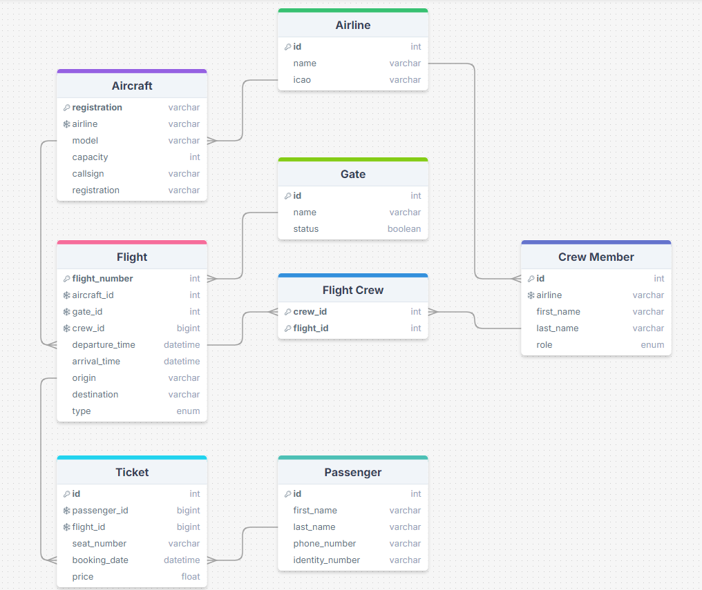
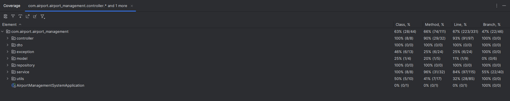
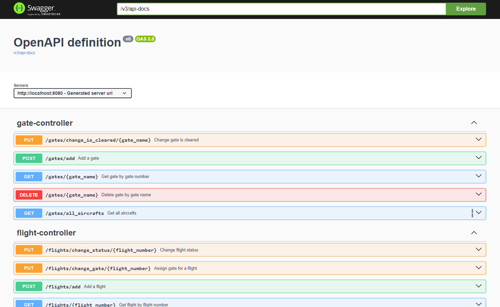

# Airport Management System

The Airport Management System is a backend for an application designed to automate the operations of an airport. This system enables efficient management of flights, passengers, tickets and aircrafts.

Documentation

## MySQL Database

## Business Requirements
1. Airport responsible should be able to add airlines along with their aircrafts and crew members.
2. Airport responsible should be able to add flights, assign aircrafts and crew members to the flights.
3. Once a flight is added, airport responsible should be able to keep track of the flight status.
4. For each flight, airport responsible should be able to see the list of tickets sold and the list of passengers.
5. Airport responsible should be able to see the list of all the flights that are scheduled for the day.
6. Airport responsible should be able to check which gate is available for an aircraft to park.
5. When an aircraft landed at the airport, airport responsible should be able to establish at which gate the aircraft should be parked.
6. Airport responsible should be able to see which crew members operates on a flight.
7. Airport responsible should be able to see the list of all the crew members that are available for a flight.
8. For a specific airline, airport responsible should be able to see the list of all the aircrafts and crew members.
9. Airport should be restricted in adding a flight if there is no available aircraft or crew members for it.
10. Airport responsible should be able to edit the flight details.

## Features for MVP
1. #### Create and manage flights

    Airport responsible can add flights for a specific airline, assign an aircraft, assign crew members, and keep track of the flight status.

2. ##### Managed aircraft on ground

    Airport responsible can see the list of all the aircraft that are parked at the airport, see which gate is available for an aircraft to park, and establish at which gate the aircraft should be parked.

 
3. ##### Create and manage flight crews

    Airport responsible can create a flight crew by adding crew members and assign them to a flight. Also, he should be able to edit the flight crew if a crew member becomes unavailable for a flight.

 
4. ##### Add tickets bought by passengers

    Airport responsible can add tickets bought by passengers for a specific flight and see the list of passengers. If tickets bought for a specific flight exceed the number of seats available, the airport responsible should be restricted in adding more tickets.

5. ##### Edit details for airlines.

    Airport responsible can keep track of entities that are related to an airline, such as aircraft, crew members or flights.

## Features

Beans for defining services:
1. AirlineService
2. AircraftService
3. CrewMemberService
4. FlightCrewService
5. FlightService
6. GateService
7. PassengerService
8. TicketService

Beans for defining repositories:
1. AirlineRepository
2. AircraftRepository
3. CrewMemberRepository
4. FlightCrewRepository
5. FlightRepository
6. GateRepository
7. PassengerRepository
8. TicketRepository

Unit tests for services and controllers:
1. AirlineServiceTest - AirlineControllerTest
2. AircraftServiceTest - AircraftControllerTest
3. CrewMemberServiceTest - CrewMemberControllerTest
4. FlightCrewServiceTest - FlightCrewControllerTest
5. FlightServiceTest - FlightControllerTest
6. GateServiceTest - GateControllerTest
7. PassengerServiceTest - PassengerControllerTest
8. TicketServiceTest - TicketControllerTest

Swagger documentation for the REST API:
http://localhost:8080/swagger-ui/index.html#/

